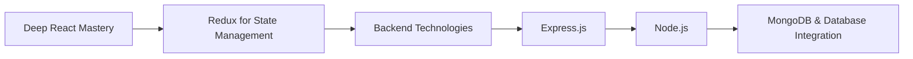

# 👋 Hi, I’m **Nitin Saini**  

💻 **Aspiring Full-Stack Developer** | Passionate about building **responsive, scalable, and user-friendly applications**.  

---

## 🚀 Current Skills & Experience

### 🖥️ Frontend Development

### 📱 Other Skills
- Responsive Web Design  
- Git & GitHub for Version Control  

---

## 🎯 Current Focus
- Mastering **React** best practices & performance optimization  
- **React Router v6** – advanced routing concepts  
- **JavaScript for the Browser** – DOM APIs, events, storage, rendering  
- **SQL** (Microsoft SQL Server) fundamentals  

---

## 🛤 Roadmap (Next Few Months)

  
## 📌 Step-by-Step Journey  
1. React Advanced Concepts → Patterns, optimization, and testing.  
2. Redux → Global state management mastery.  
3. Backend Development → Express.js, Node.js, MongoDB.  
4. Full-Stack Projects → Building production-ready apps end-to-end.  
  
## 🤝 Looking to Collaborate On  
• Frontend or full-stack projects  
• Open-source contributions  
• UI/UX improvement initiatives  
  
## 📫 Reach Me  
• Email: nitinsaini.dev@gmail.com  
• LinkedIn: [linkedin.com/in/passenger-1o8 ](https://www.linkedin.com/in/passenger-1o8/)  
• LeetCode: [leetcode.com/u/passenger108](https://leetcode.com/u/passenger108/)  
  
## ⚡ Fun Fact  
I believe every line of code should not only work but tell a story of clarity, purpose, and scalability.  
  
---
  
