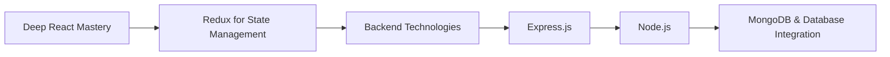

# 👋 Hi, I’m **Nitin Saini**  

💻 **Aspiring Engineer** | Passionate about  **techs and building something of my own**.  

---

## Current Projects I am working on!

### 1.  FileTask - Task Assigning and Marking System --- [link](https://github.com/Passenger108/FileTask)
    FileTask - Task Assigning and Marking System
    ❗Note: This project is best viewed on desktop (not fully optimized for mobiles yet)

    FileTask is a frontend-only, role-based task assignment system built using React, React Router v6, and CSS, with data persisted in React Context. 
     • Implemented role-based routing using React Router v6 (admin vs employee views)
     • Applied auth guard and conditional redirection to protect routes and prevent back-history access
     • Used Custom Context API logic to simulate backend-like persistence across reloads
     • Followed component-driven design with reusable and modular components
     •. Data-Driven UI
     • Designed a clean, styled UI with CSS for each screen — admin vs employee
     • Developed core logic for task assignment, adding new employees, filtering, and progress tracking

### 2. react-hooks-wallet - Super 20 ( A react library ) --- [link](https://github.com/Passenger108/react-hooks-wallet)
    Project Goal:
    This library provides 20 real-world, reusable custom React hooks built from scratch using both core and advanced built-in React APIs. The aim is to strengthen mastery in:
     • Functional React design patterns
     • Integration with various Browser APIs
     • Leveraging advanced React hooks like useCallback, useReducer, and useRef 
     • Writing clean, maintainable, and scalable hook logic
     • Performance tuning and best practices
     
    This project helped me not only master the fundamentals but also gain hands-on experience in designing hooks that handle real-world scenarios — such as idle detection, page visibility tracking, media queries, geolocation, and more — with proper cleanup, reusability, and edge case handling.

## 🚀 Current Skills & Experience

### 🖥️ Frontend Development

### 📱 Other Skills
- Responsive Web Design  
- Git & GitHub for Version Control  

## 🎯 Current Focus
- Mastering **React** best practices & performance optimization  
- **React Router v6** – advanced routing concepts  
- **JavaScript for the Browser** – DOM APIs, events, storage, rendering  
- **SQL** (Microsoft SQL Server) fundamentals  

## 🛤 My next Move (Next Few Months)

  
## 📌 Next Short term goals 
1. React Advanced Concepts → Patterns, optimization, and testing.  
2. Redux → Global state management mastery.  
3. Backend Development → Express.js, Node.js, MongoDB.  
4. Full-Stack Projects → Building production-ready apps end-to-end.

  
## 🤝 Looking to Collaborate On  
• Frontend or full-stack projects  
• Open-source contributions  
• UI/UX improvement initiatives  

  
## 📫 Reach Me  
• Email: nitinsaini.dev@gmail.com  
• LinkedIn: [linkedin.com/in/passenger-1o8 ](https://www.linkedin.com/in/passenger-1o8/)  
• LeetCode: [leetcode.com/u/passenger108](https://leetcode.com/u/passenger108/)  
  
## ⚡ Fun Fact  
I believe every line of code should not only work but tell a story of clarity, purpose, and scalability.  
  
---

## 
  
